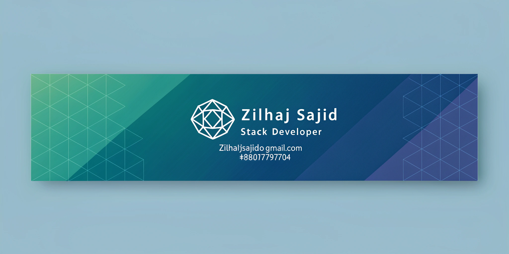

# Hi 👋, I'm Md.Zilhaj Un Noor

### Web Developer passionate about clean UI & smooth UX.

- 🔭 I'm currently working on **Personal projects to strengthen React & Firebase knowledge.**

- 🌱 I'm currently learning **Backend basics with Node.js & Express.**

- 👯 I'm looking to collaborate on **React + Firebase apps (auth, dashboards, CRUD systems)**

- 🤝 I'm looking for help with **Improving my React/Next.js skills and learning best practices for building scalable web apps.**

- 💬 Ask me about **React, Tailwind, and modern frontend development,
Building responsive user interfaces,
Firebase authentication & integration and
API integration and frontend architecture.**

- 📫 How to reach me **zilhajsajid@gmail.com**

- ⚡ Fun fact **I enjoy building real-world apps and learning new tech stacks along the way.**

<h3 align="left">Connect with me:</h3>

<h3 align="left">Languages and Tools:</h3>

              

